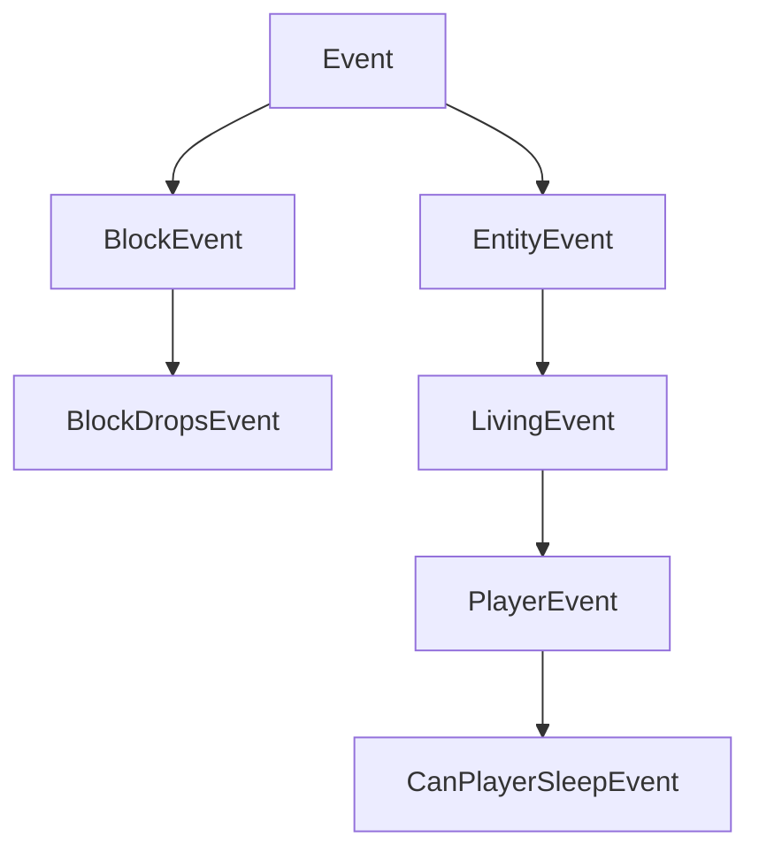

import Tabs from '@theme/Tabs';
import TabItem from '@theme/TabItem';

# 事件

NeoForge 的主要特性之一是事件系统。游戏内发生的各种事情都会触发事件。例如，当玩家右键、玩家或其他实体跳跃、方块被渲染、游戏加载时，都会有相应的事件。模组开发者可以为这些事件订阅事件处理器，然后在这些事件处理器中执行他们想要的行为。

事件在其各自的事件总线上被触发。最重要的总线是 `NeoForge.EVENT_BUS`，也被称为**游戏**总线。除此之外，在启动期间，会为每个加载的模组生成一个模组总线，并传递到该模组的构造函数中。许多模组总线事件是并行触发的（与总在同一线程上运行的主总线事件相对），这极大地提高了启动速度。更多信息请参见[下文][modbus]。

## 注册事件处理器

注册事件处理器有多种方法。所有这些方法的共同点在于，每个事件处理器都是一个只有一个事件参数且没有返回值（即返回类型为 `void`）的方法。

### `IEventBus#addListener`

注册方法处理器最简单的方式是注册它们的方法引用，就像这样：

```java
@Mod("yourmodid")
public class YourMod {
    public YourMod(IEventBus modBus) {
        NeoForge.EVENT_BUS.addListener(YourMod::onLivingJump);
    }

    // Heals an entity by half a heart every time they jump.
    private static void onLivingJump(LivingEvent.LivingJumpEvent event) {
        LivingEntity entity = event.getEntity();
        // Only heal on the server side
        if (!entity.level().isClientSide()) {
            entity.heal(1);
        }
    }
}
```

### `@SubscribeEvent`

另外，事件处理器也可以通过创建事件处理器方法并用 `@SubscribeEvent` 注解来驱动。然后，你可以将包含该方法的类的实例传递给事件总线，从而注册该实例中所有用 `@SubscribeEvent` 注解的事件处理器：

```java
public class EventHandler {
    @SubscribeEvent
    public void onLivingJump(LivingEvent.LivingJumpEvent event) {
        LivingEntity entity = event.getEntity();
        if (!entity.level().isClientSide()) {
            entity.heal(1);
        }
    }
}

@Mod("yourmodid")
public class YourMod {
    public YourMod(IEventBus modBus) {
        NeoForge.EVENT_BUS.register(new EventHandler());
    }
}
```

你也可以静态地进行。只需将所有事件处理器设为静态，然后传入类本身，而不是类的实例：

```java
public class EventHandler {
    @SubscribeEvent
    public static void onLivingJump(LivingEvent.LivingJumpEvent event) {
        LivingEntity entity = event.getEntity();
        if (!entity.level().isClientSide()) {
            entity.heal(1);
        }
    }
}

@Mod("yourmodid")
public class YourMod {
    public YourMod(IEventBus modBus) {
        NeoForge.EVENT_BUS.register(EventHandler.class);
    }
}
```

### `@EventBusSubscriber`

我们可以更进一步，用 `@EventBusSubscriber` 注解事件处理器类。这个注解会被 NeoForge 自动发现，让你能从模组构造函数中移除所有事件相关的代码。本质上，它等同于在模组构造函数末尾调用 `NeoForge.EVENT_BUS.register(EventHandler.class)` 和 `modBus.register(EventHandler.class)`。这也意味着所有处理器都必须是静态的。

虽然不是必需的，但强烈建议在注解中指定 `modid` 参数，以便于调试（尤其是在处理模组冲突时）。

```java
@EventBusSubscriber(modid = "yourmodid")
public class EventHandler {
    @SubscribeEvent
    public static void onLivingJump(LivingEvent.LivingJumpEvent event) {
        LivingEntity entity = event.getEntity();
        if (!entity.level().isClientSide()) {
            entity.heal(1);
        }
    }
}
```

## 事件选项

### 字段和方法

字段和方法可能是事件最显而易见的部分。大多数事件包含供事件处理器使用的上下文，例如引起事件的实体或事件发生的 `level`。

### 继承体系

为了利用继承的优势，一些事件不直接扩展 `Event`，而是扩展它的某个子类，例如 `BlockEvent`（包含与方块相关事件的方块上下文）或 `EntityEvent`（类似地包含实体上下文）及其子类 `LivingEvent`（用于 `LivingEntity` 特定的上下文）和 `PlayerEvent`（用于 `Player` 特定的上下文）。这些提供上下文的父事件是 `abstract` 的，不能被监听。

:::danger
如果你监听一个 `abstract` 事件，你的游戏将会崩溃，因为这绝不是你想要做的。你应该总是监听它的某个子事件。
:::



### 可取消的事件

一些事件实现了 `ICancellableEvent` 接口。这些事件可以使用 `#setCanceled(boolean canceled)` 来取消，并且可以使用 `#isCanceled()` 检查取消状态。如果一个事件被取消，该事件的其他事件处理器将不会运行，并且会启用与“取消”相关的某种行为。例如，取消 `LivingChangeTargetEvent` 将阻止实体的目标实体发生改变。

事件处理器可以选择显式接收已取消的事件。这可以通过将 `IEventBus#addListener`（或 `@SubscribeEvent`，取决于你附加事件处理器的方式）中的布尔参数 `receiveCanceled` 设置为 true 来实现。

### 三态和结果

一些事件有三种潜在的返回状态，由 `TriState` 表示，或者直接在事件类上有一个 `Result` 枚举。返回状态通常可以取消事件正在处理的动作（`TriState#FALSE`），强制执行该动作（`TriState#TRUE`），或执行默认的原版行为（`TriState#DEFAULT`）。

一个具有三种潜在返回状态的事件会有一些 `set*` 方法来设置期望的结果。

```java
// In some event handler class

@SubscribeEvent // on the game event bus
public static void renderNameTag(RenderNameTagEvent.CanRender event) {
    // Uses TriState to set the return state
    event.setCanRender(TriState.FALSE);
}

@SubscribeEvent // on the game event bus
public static void mobDespawn(MobDespawnEvent event) {
    // Uses a Result enum to set the return state
    event.setResult(MobDespawnEvent.Result.DENY);
}
```

### 优先级

事件处理器可以有选择地被分配一个优先级。`EventPriority` 枚举包含五个值：`HIGHEST`, `HIGH`, `NORMAL` (默认), `LOW` 和 `LOWEST`。事件处理器按从最高到最低的优先级顺序执行。如果它们的优先级相同，在主总线上它们按注册顺序触发，这大致与模组加载顺序相关；在模组总线上则严格按照模组加载顺序触发（见下文）。

可以通过在 `IEventBus#addListener` 或 `@SubscribeEvent` 中设置 `priority` 参数来定义优先级，具体取决于你如何附加事件处理器。请注意，对于并行触发的事件，优先级会被忽略。

### 分侧事件

一些事件只在某一[侧][side]触发。常见的例子包括各种渲染事件，它们只在客户端触发。由于仅限客户端的事件通常需要访问 Minecraft 代码库中其他仅限客户端的部分，因此需要相应地进行注册。

使用 `IEventBus#addListener()` 的事件处理器应通过 `FMLEnvironment.dist` 或你的模组构造函数中的 `Dist` 参数检查当前的物理侧，并在一个单独的仅限客户端的类中添加监听器，正如在关于[侧][side]的文章中所述。

使用 `@EventBusSubscriber` 的事件处理器可以将侧指定为注解的 `value` 参数，例如 `@EventBusSubscriber(value = Dist.CLIENT, modid = "yourmodid")`。

## 事件总线

虽然大多数事件都在 `NeoForge.EVENT_BUS` 上发布，但有些事件会在模组事件总线上发布。这些通常被称为模组总线事件。模组总线事件可以通过它们的父接口 `IModBusEvent` 与常规事件区分开来。

模组事件总线作为参数在模组构造函数中传递给你，然后你可以向其订阅模组总线事件。如果你使用 `@EventBusSubscriber`，事件将自动订阅到正确的总线。

### 模组生命周期

大多数模组总线事件是所谓的生命周期事件。生命周期事件在启动期间，在每个模组的生命周期中运行一次。其中许多是通过子类化 `ParallelDispatchEvent` 并行触发的；如果你想在主线程上运行这些事件中的代码，请使用 `#enqueueWork(Runnable runnable)` 将它们入队。

生命周期通常遵循以下顺序：

- 模组构造函数被调用。在此处或下一步中注册你的事件处理器。
- 所有 `@EventBusSubscriber` 被调用。
- `FMLConstructModEvent` 被触发。
- 注册表事件被触发，这些包括 [`NewRegistryEvent`][newregistry]、[`DataPackRegistryEvent.NewRegistry`][newdatapackregistry] 以及针对每个注册表的 [`RegisterEvent`][registerevent]。
- `FMLCommonSetupEvent` 被触发。这里进行各种杂项设置。
- [按侧][side]的设置事件被触发：如果在物理客户端上，则为 `FMLClientSetupEvent`；如果在物理服务器上，则为 `FMLDedicatedServerSetupEvent`。
- 处理 `InterModComms`（见下文）。
- `FMLLoadCompleteEvent` 被触发。

#### `InterModComms`

`InterModComms` 是一个允许模组开发者向其他模组发送消息以实现兼容性功能的系统。这个类为模组保存消息，所有方法都是线程安全的。该系统主要由两个事件驱动：`InterModEnqueueEvent` 和 `InterModProcessEvent`。

在 `InterModEnqueueEvent` 期间，你可以使用 `InterModComms#sendTo` 向其他模组发送消息。这些方法接受要发送消息的模组 ID、与消息数据关联的键（以区分不同的消息），以及一个持有消息数据的 `Supplier`。发送者也可以选择性地指定。

然后，在 `InterModProcessEvent` 期间，你可以使用 `InterModComms#getMessages` 来获取所有接收到的消息的流，这些消息是 `IMCMessage` 对象。它们包含数据的发送者、数据的预期接收者、数据键以及实际数据的 `supplier`。

### 其他模组总线事件

除了生命周期事件，还有一些杂项事件在模组事件总线上触发，主要是出于历史原因。这些通常是你可以注册、设置或初始化各种事物的事件。与生命周期事件相比，这些事件大多不是并行运行的。一些例子：

- `RegisterColorHandlersEvent.Block`, `.ItemTintSources`, `.ColorResolvers`
- `ModelEvent.BakingCompleted`
- `TextureAtlasStitchedEvent`

:::warning
这些事件中的大多数计划在未来版本中移至游戏事件总线。
:::

[modbus]: #event-buses
[newdatapackregistry]: registries.md#custom-datapack-registries
[newregistry]: registries.md#custom-registries
[registerevent]: registries.md#registerevent
[side]: sides.md