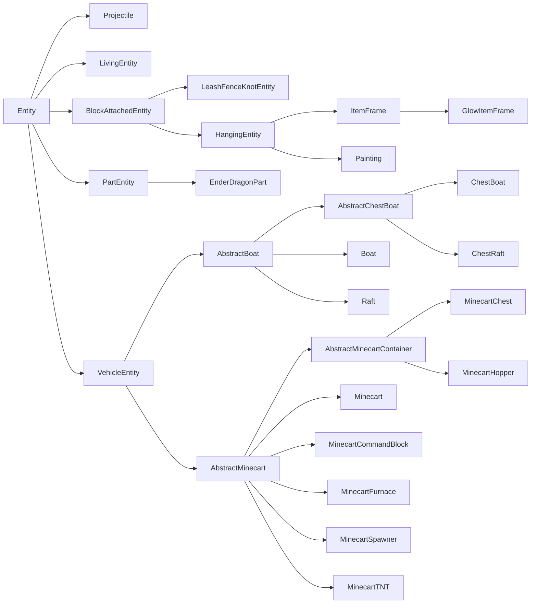
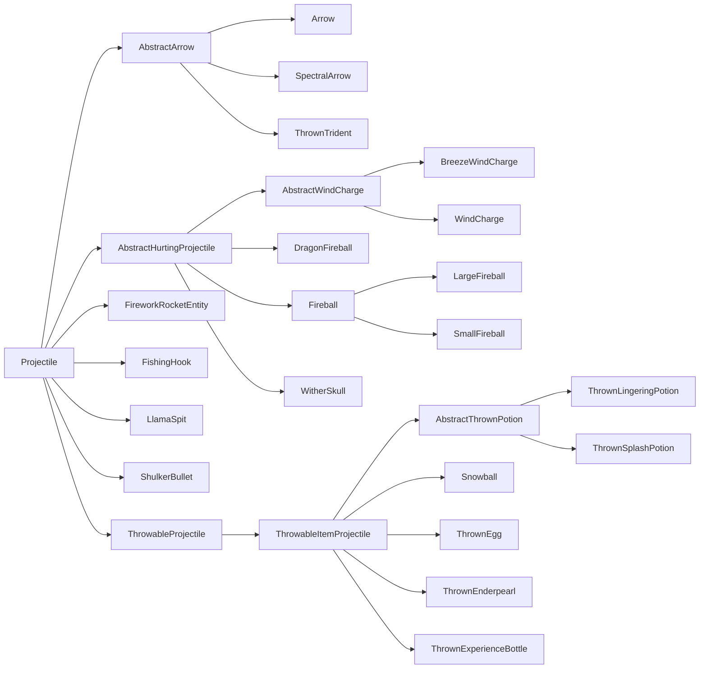

# 实体

实体是游戏世界中的对象，可以通过多种方式与世界互动。常见的例子包括生物、抛射物、可骑乘对象，甚至玩家。每个实体都由多个系统组成，乍一看可能难以理解。本节将分解一些与构建实体以及使其按照模组制作者的意图行动相关的关键组件。

## 术语

一个简单的实体由三部分组成：

- [`Entity`][entity] 子类，它持有我们实体的大部分逻辑
- [`EntityType`][type]，它被[注册][registration]并持有某些通用属性，以及
- [`EntityRenderer`][renderer]，它负责在游戏中显示实体

更复杂的实体可能需要更多部分。例如，许多更复杂的 `EntityRenderer` 会使用一个底层的 `EntityModel` 实例。或者，一个自然生成的实体将需要某种[生成机制][spawning]。

## `EntityType`

`EntityType` 与 `Entity` 之间的关系类似于 [`Item`][item] 与 [`ItemStack`][itemstack] 之间的关系。与 `Item` 类似，`EntityType` 是注册到其对应注册表（实体类型注册表）的单例，并持有该类型所有实体共有的某些值，而 `Entity` 则像 `ItemStack` 一样，是该单例类型的“实例”，持有特定于该实体实例的数据。然而，这里的关键区别在于，大多数行为不是在单例的 `EntityType` 中定义的，而是在实例化的 `Entity` 类本身中定义的。

让我们创建我们的 `EntityType` 注册表，并为其注册一个 `EntityType`，假设我们有一个继承自 `Entity` 的 `MyEntity` 类（更多信息请参见[下文][entity]）。`EntityType.Builder` 上的所有方法，除了最后的 `#build` 调用外，都是可选的。

```java
public static final DeferredRegister.Entities ENTITY_TYPES =
    DeferredRegister.createEntities(ExampleMod.MOD_ID);

public static final Supplier<EntityType<MyEntity>> MY_ENTITY = ENTITY_TYPES.register(
    "my_entity",
    // The entity type, created using a builder.
    () -> EntityType.Builder.of(
        // An EntityType.EntityFactory<T>, where T is the entity class used - MyEntity in this case.
        // You can think of it as a BiFunction<EntityType<T>, Level, T>.
        // This is commonly a reference to the entity constructor.
        MyEntity::new,
        // The MobCategory our entity uses. This is mainly relevant for spawning.
        // See below for more information.
        MobCategory.MISC
    )
    // The width and height, in blocks. The width is used in both horizontal directions.
    // This also means that non-square footprints are not supported. Default is 0.6f and 1.8f.
    .sized(1.0f, 1.0f)
    // A multiplicative factor (scalar) used by mobs that spawn in varying sizes.
    // In vanilla, these are only slimes and magma cubes, both of which use 4.0f.
    .spawnDimensionsScale(4.0f)
    // The eye height, in blocks from the bottom of the size. Defaults to height * 0.85.
    // This must be called after #sized to have an effect.
    .eyeHeight(0.5f)
    // Disables the entity being summonable via /summon.
    .noSummon()
    // Prevents the entity from being saved to disk.
    .noSave()
    // Makes the entity fire immune.
    .fireImmune()
    // Makes the entity immune to damage from a certain block. Vanilla uses this to make
    // foxes immune to sweet berry bushes, withers and wither skeletons immune to wither roses,
    // and polar bears, snow golems and strays immune to powder snow.
    .immuneTo(Blocks.POWDER_SNOW)
    // Disables a rule in the spawn handler that limits the distance at which entities can spawn.
    // This means that no matter the distance to the player, this entity can spawn.
    // Vanilla enables this for pillagers and shulkers.
    .canSpawnFarFromPlayer()
    // The range in which the entity is kept loaded by the client, in chunks.
    // Vanilla values for this vary, but it's often something around 8 or 10. Defaults to 5.
    // Be aware that if this is greater than the client's chunk view distance,
    // then that chunk view distance is effectively used here instead.
    .clientTrackingRange(8)
    // How often update packets are sent for this entity, in once every x ticks. This is set to higher values
    // for entities that have predictable movement patterns, for example projectiles. Defaults to 3.
    .updateInterval(10)
    // Build the entity type using a resource key. The second parameter should be the same as the entity id.
    .build(ResourceKey.create(
        Registries.ENTITY_TYPE,
        ResourceLocation.fromNamespaceAndPath("examplemod", "my_entity")
    ))
);

// Shorthand version to avoid boilerplate. The following call is the same as
// ENTITY_TYPES.register("my_entity", () -> EntityType.Builder.of(MyEntity::new, MobCategory.MISC).build(
//     ResourceKey.create(Registries.ENTITY_TYPE, ResourceLocation.fromNamespaceAndPath("examplemod", "my_entity"))
// );
public static final Supplier<EntityType<MyEntity>> MY_ENTITY =
    ENTITY_TYPES.registerEntityType("my_entity", MyEntity::new, MobCategory.MISC);

// Shorthand version that still allows calling additional builder methods
// by supplying a UnaryOperator<EntityType.Builder> parameter.
public static final Supplier<EntityType<MyEntity>> MY_ENTITY = ENTITY_TYPES.registerEntityType(
    "my_entity", MyEntity::new, MobCategory.MISC,
    builder -> builder.sized(2.0f, 2.0f).eyeHeight(1.5f).updateInterval(5));
```

### `MobCategory`

_另请参阅[自然生成][mobspawn]。_

实体的 `MobCategory` 决定了该实体的一些属性，这些属性与[生成和消失][mobspawn]有关。原版默认添加了总共八种 `MobCategory`：

| 名称                         | 生成上限 | 示例                                                                                                                  |
|------------------------------|-----------|--------------------------------------------------------------------------------------------------------------------------------|
| `MONSTER`                    | 70        | 各种怪物                                                                                                              |
| `CREATURE`                   | 10        | 各种动物                                                                                                              |
| `AMBIENT`                    | 15        | 蝙蝠                                                                                                                  |
| `AXOLOTS`                    | 5         | 美西螈                                                                                                                  |
| `UNDERGROUND_WATER_CREATURE` | 5         | 发光鱿鱼                                                                                                                 |
| `WATER_CREATURE`             | 5         | 鱿鱼、海豚                                                                                                              |
| `WATER_AMBIENT`              | 20        | 鱼                                                                                                                    |
| `MISC`                       | N/A       | 所有非生物实体，例如抛射物；使用此 `MobCategory` 将使实体完全无法自然生成 |

还有一些其他属性，每个仅在一两个 `MobCategory` 上设置：

- `isFriendly`：对于 `MONSTER` 设置为 false，对于所有其他类型设置为 true。
- `isPersistent`：对于 `CREATURE` 和 `MISC` 设置为 true，对于所有其他类型设置为 false。
- `despawnDistance`：对于 `WATER_AMBIENT` 设置为 64，对于所有其他类型设置为 128。

:::info
`MobCategory` 是一个[可扩展枚举][extenum]，这意味着您可以向其添加自定义条目。如果您这样做，您还需要为这种自定义 `MobCategory` 的实体添加某种生成机制。
:::

## 实体类

首先，我们创建一个 `Entity` 的子类。除了构造函数，`Entity`（一个抽象类）定义了四个我们需要实现的方法。前三个将在[数据与网络文章][data]中解释，以免本文过于臃肿，而`#hurtServer`将在[伤害实体部分][damaging]中解释。

```java
public class MyEntity extends Entity {
    // We inherit this constructor without the bound on the generic wildcard.
    // The bound is needed for registration below, so we add it here.
    public MyEntity(EntityType<? extends MyEntity> type, Level level) {
        super(type, level);
    }

    // See the Data and Networking article for information about these methods.
    @Override
    protected void readAdditionalSaveData(ValueInput input) {}

    @Override
    protected void addAdditionalSaveData(ValueOutput output) {}

    @Override
    protected void defineSynchedData(SynchedEntityData.Builder builder) {}

    @Override
    public boolean hurtServer(ServerLevel level, DamageSource damageSource, float amount) {
        return true;
    }
}
```

:::info
虽然 `Entity` 可以直接继承，但通常使用它的众多子类之一作为基础更有意义。更多信息请参见[实体类继承体系][hierarchy]。
:::

如果需要（例如，因为您正在从代码中生成实体），您也可以添加自定义构造函数。这些通常将实体类型硬编码为对已注册对象的引用，如下所示：

```java
public MyEntity(EntityType<? extends MyEntity> type, Level level, double x, double y, double z) {
    // Delegates to the factory constructor, using the EntityType we registered before.
    this(type, level);
    this.setPos(x, y, z);
}
```

:::warning
自定义构造函数不应恰好有两个参数，因为这会与上面的 `(EntityType, Level)` 构造函数产生混淆。
:::

现在，我们基本上可以对我们的实体做任何我们想做的事情了。以下小节将展示各种常见的实体用例。

### 实体上的数据存储

_见 [实体/数据与网络][data]。_

### 渲染实体

_见 [实体/实体渲染器][renderer]。_

### 生成实体

如果我们现在启动游戏并进入一个世界，我们只有一种生成方式：通过[`/summon`][summon]命令（假设没有调用`EntityType.Builder#noSummon`）。

显然，我们想通过其他方式添加我们的实体。最简单的方法是通过 `LevelWriter#addFreshEntity` 方法。这个方法简单地接受一个 `Entity` 实例并将其添加到世界中，如下所示：

```java
// In some method that has a level available, only on the server
if (!level.isClientSide()) {
    MyEntity entity = new MyEntity(level, 100.0, 200.0, 300.0);
    level.addFreshEntity(entity);
}
```

或者，你也可以调用 `EntityType#spawn`，这在生成[生物实体][livingentity]时尤其推荐，因为它会执行一些额外的设置，比如触发生成[事件][event]。

这几乎将用于所有非生物实体。玩家显然不应该由您自己生成，`Mob` 有[它们自己的生成方式][mobspawn]（尽管它们也可以通过 `#addFreshEntity` 添加），而原版的[抛射物][projectile]在 `Projectile` 类中也有用于生成的静态辅助方法。

### 伤害实体

_另见[物品左键点击][leftclick]。_

虽然并非所有实体都有生命值的概念，但它们仍然都能受到伤害。这不仅用于像生物和玩家这样的东西：如果你想到物品实体（掉落的物品），它们也会受到来自火或仙人掌等来源的伤害，在这种情况下它们通常会立即被删除。

可以通过调用 `Entity#hurt` 或 `Entity#hurtOrSimulate` 来对实体造成伤害，这两者之间的区别解释如下。这两个方法都接受两个参数：[`DamageSource`][damagesource] 和伤害量（以半心为单位的浮点数）。例如，调用 `entity.hurt(entity.damageSources().wither(), 4.25)` 将造成略多于两颗心的凋零伤害。

反过来，实体也可以修改该行为。这不是通过重写 `#hurt` 来完成的，因为它是一个 final 方法。相反，有两个方法 `#hurtServer` 和 `#hurtClient`，分别处理对应端的伤害逻辑。`#hurtClient` 通常用于告诉客户端攻击已成功，尽管这可能不总是真的，主要是为了无论如何都播放攻击声音和其他效果。对于改变伤害行为，我们主要关心 `#hurtServer`，我们可以像这样重写它：

```java
@Override
// The boolean return value determines whether the entity was actually damaged or not.
public boolean hurtServer(ServerLevel level, DamageSource damageSource, float amount) {
    if (damageSource.is(DamageTypeTags.IS_FIRE)) {
        // This assumes that super#hurtServer() is implemented. Common other ways to do this
        // are to set some field yourself. Vanilla implementations vary greatly across different entities.
        // Notably, living entities usually call #actuallyHurt, which in turn calls #setHealth.
        return super.hurtServer(level, damageSource, amount * 2);
    } else {
        return false;
    }
}
```

这种服务器/客户端分离也是 `Entity#hurt` 和 `Entity#hurtOrSimulate` 之间的区别：`Entity#hurt` 只在服务器上运行（并调用 `Entity#hurtServer`），而 `Entity#hurtOrSimulate` 在两边都运行，根据端调用 `Entity#hurtServer` 或 `Entity#hurtClient`。

通过事件还可以修改对不属于您的实体（即由 Minecraft 或其他模组添加的实体）造成的伤害。这些事件包含大量特定于 `LivingEntity` 的代码；因此，它们的文档位于[生物实体文章][livingentity]中的[伤害事件部分][damageevents]。

### 实体 Tick

很多时候，你会希望你的实体每 tick 做一些事情（例如移动）。这个逻辑被分散在几个方法中：

- `#tick`：这是核心的 tick 方法，也是你在 99% 的情况下想要重写的方法。
    - 默认情况下，它会转发到 `#baseTick`，但是几乎每个子类都重写了它。
- `#baseTick`：这个方法处理更新所有实体共有的一些值，包括“着火”状态、细雪造成的冰冻、游泳状态以及穿过传送门。`LivingEntity` 在这里还处理溺水、方块内伤害以及伤害追踪器的更新。如果你想改变或增加这些逻辑，可以重写这个方法。
    - 默认情况下，`Entity#tick` 会转发到这个方法。
- `#rideTick`：这个方法为其他实体的乘客调用，例如玩家骑马，或者任何由于使用 `/ride` 命令而骑乘另一个实体的实体。
    - 默认情况下，它会做一些检查然后调用 `#tick`。骷髅和玩家重写了这个方法来特殊处理骑乘实体的情况。

此外，该实体有一个名为 `tickCount` 的字段，表示该实体在世界中已存在的时间（以刻为单位），以及一个名为 `firstTick` 的布尔值字段，其含义应该不言自明。例如，如果你想每 5 刻[生成一个粒子][particle]，你可以使用以下代码：

```java
@Override
public void tick() {
    // Always call super unless you have a good reason not to.
    super.tick();
    // Run this code once every 5 ticks, and make sure we spawn the particle on the server.
    if (this.tickCount % 5 == 0 && !this.level().isClientSide()) {
        this.level().addParticle(...);
    }
}
```

### 选取实体

_另见[中键点击][middleclick]。_

选取是选择玩家当前正在看着的东西的过程，以及随后拾取相关物品的过程。中键点击的结果，称为“选取结果”，可以由您的实体修改（请注意，`Mob` 类会为您选择正确的刷怪蛋）：

```java
@Override
@Nullable
public ItemStack getPickResult() {
    // Assumes that MY_CUSTOM_ITEM is a DeferredItem<?>, see the Items article for more information.
    // If the entity should not be pickable, it is advised to return null here.
    return new ItemStack(MY_CUSTOM_ITEM.get());
}
```

虽然实体通常应该是可以选取的，但在某些特殊情况下，这并不可取。一个原版的用例是末影龙，它由多个部分组成。父实体的选取功能被禁用，但其部分又重新启用了，以实现更精细的碰撞箱调整。

如果您有类似的小众用例，您的实体也可以完全禁用选取，如下所示：

```java
@Override
public boolean isPickable() {
    // Additional checks may be performed here if needed.
    return false;
}
```

如果你想自己进行选取（即射线投射），你可以在你想要开始射线投射的实体上调用 `Entity#pick`。这将返回一个 [`HitResult`][hitresult]，你可以进一步检查射线投射具体击中了什么。

### 实体附着点

_不要与[数据附件][dataattachments]混淆。_

实体附着点用于为实体定义视觉附着点。使用这个系统，可以定义像乘客或名称标签这样的东西将相对于实体本身显示在哪里。实体本身只控制附着点的默认位置，然后附着点可以定义一个与该默认位置的偏移量。

构建 `EntityType` 时，可以通过调用 `EntityType.Builder#attach` 设置任意数量的附着点。此方法接受一个 `EntityAttachment`（定义要考虑的附着点）和三个浮点数（定义位置 x/y/z）。位置应相对于附着点的默认值所在位置来定义。

原版定义了以下四种 `EntityAttachment`：

| 名称           | 默认值                                | 用途                                                               |
|----------------|------------------------------------------|----------------------------------------------------------------------|
| `PASSENGER`    | 碰撞箱的中心 X/顶部 Y/中心 Z    | 可骑乘实体，例如马，用于定义乘客出现的位置    |
| `VEHICLE`      | 碰撞箱的中心 X/底部 Y/中心 Z    | 所有实体，用于定义它们在骑乘另一个实体时出现的位置 |
| `NAME_TAG`     | 碰撞箱的中心 X/顶部 Y/中心 Z    | 定义实体的名称标签出现的位置（如果适用）       |
| `WARDEN_CHEST` | 碰撞箱的中心 X/中心 Y/中心 Z    | 由监守者使用，定义音爆攻击的来源    |

:::info
`PASSENGER` 和 `VEHICLE` 是相关的，因为它们在相同的上下文中使用。首先，`PASSENGER` 被应用于定位骑手。然后，`VEHICLE` 被应用于骑手。
:::

每个附着点可以被看作是从 `EntityAttachment` 到 `List<Vec3>` 的映射。实际使用的点数取决于消费系统。例如，船和骆驼将使用两个 `PASSENGER` 点，而像马或矿车这样的实体将只使用一个 `PASSENGER` 点。

`EntityType.Builder` 也有一些与 `EntityAttachment` 相关的辅助方法：

- `#passengerAttachment()`：用于定义 `PASSENGER` 附着点。有两种变体。
    - 一种变体接受 `Vec3...` 附着点。
    - 另一种接受 `float...`，它通过将每个浮点数转换为一个使用给定浮点数作为 y 值并将 x 和 z 设置为 0 的 `Vec3` 来转发到 `Vec3...` 变体。
- `#vehicleAttachment()`：用于定义一个 `VEHICLE` 附着点。接受一个 `Vec3`。
- `#ridingOffset()`：用于定义一个 `VEHICLE` 附着点。接受一个浮点数，并用一个 x 和 z 值为 0，y 值为传入浮点数负值的 `Vec3` 转发给 `#vehicleAttachment()`。
- `#nameTagOffset()`：用于定义 `NAME_TAG` 附着点。接受一个浮点数，用于 y 值，x 和 z 值使用 0。

或者，可以通过调用 `EntityAttachments#builder()` 然后在该构建器上调用 `#attach()` 来自定义附件，如下所示：

```java
// In some EntityType<?> creation
EntityType.Builder.of(...)
    // This EntityAttachment will make name tags float half a block above the ground.
    // If this is not set, it will default to the entity's hitbox height.
    .attach(EntityAttachment.NAME_TAG, 0, 0.5f, 0)
    .build();
```

## 实体类继承体系

由于实体类型繁多，`Entity` 的子类形成了一个复杂的继承体系。在制作自己的实体时，了解这些子类很重要，因为通过重用它们的代码可以节省大量工作。

原版实体继承体系如下所示（红色类为 `abstract`，蓝色类为非 `abstract`）：



让我们来分解一下这些：

- `Projectile`：各种抛射物的基础类，包括箭、火球、雪球、烟花和类似实体。在[下文][projectile]了解更多信息。
- `LivingEntity`：所有“活的”东西的基础类，即拥有生命值、装备、[生物效果][mobeffect]等属性的实体。包括怪物、动物、村民和玩家。在[生物实体文章][livingentity]中了解更多信息。
- `BlockAttachedEntity`：固定不动且附着于方块的实体的基类。包括拴绳结、物品展示框和画。子类主要用于重用通用代码。
- `PartEntity`：NeoForge 添加的一个部分实体的基类，即由多个较小实体组成的实体。`EnderDragonPart` 被修改为继承 `PartEntity` 而非 `Entity`。
- `VehicleEntity`：船和矿车的基类。虽然这些实体与 `LivingEntity` 粗略地共享生命值的概念，但它们与 `LivingEntity` 没有许多其他共同属性，因此保持分离。子类主要用于重用通用代码。

还有一些实体是 `Entity` 的直接子类，仅仅因为没有其他合适的父类。其中大多数应该是不言自明的：

- `AreaEffectCloud` (滞留药水云)
- `EndCrystal`
- `EvokerFangs`
- `ExperienceOrb`
- `EyeOfEnder`
- `FallingBlockEntity` (掉落的沙子、沙砾等)
- `ItemEntity` (掉落的物品)
- `LightningBolt`
- `OminousItemSpawner` (用于持续生成试炼刷怪笼的战利品)
- `PrimedTnt`

此图表和列表中未包括地图制作者实体（显示实体、交互实体和标记实体）。

### 抛射物

抛射物是实体的一个子群。它们的共同点是它们会朝一个方向飞行直到撞到东西，并且它们有一个所属的主人（例如，玩家或骷髅可以是箭的主人，或者恶魂可以是火球的主人）。

抛射物的类继承体系如下所示（红色类是 `abstract`，蓝色类不是）：



值得注意的是 `Projectile` 的三个直接抽象子类：

- `AbstractArrow`：这个类涵盖了不同种类的箭和三叉戟。一个重要的共同属性是它们不会直线飞行，而是会受到重力影响。
- `AbstractHurtingProjectile`：该类涵盖了恼鬼的`风弹`、各种火球和凋灵之首。这些是造成伤害且不受重力影响的抛射物。
- `ThrowableProjectile`：这个类涵盖了像鸡蛋、雪球和末影珍珠这样的东西。像箭一样，它们受重力影响，但与箭不同，它们在击中目标时不会造成伤害。它们也都是通过使用相应的[物品]生成的。

可以通过继承 `Projectile` 或一个合适的子类来创建一个新的抛射物，然后重写所需的方法来添加你的功能。常被重写的方法包括：

- `#shoot`：计算并设置抛射物的正确速度。
- `#onHit`：当击中某物时调用。
    - `#onHitEntity`：当击中的是[实体]时调用。
    - `#onHitBlock`：当击中的是[方块]时调用。
- `#getOwner` 和 `#setOwner`，分别用于获取和设置所属实体。
- `#deflect`，根据传入的 `ProjectileDeflection` 枚举值来偏转抛射物。
- `#onDeflection`，从 `#deflect` 中调用，用于任何偏转后的行为。

[block]: ../blocks/index.md
[damageevents]: livingentity.md#damage-events
[damagesource]: ../resources/server/damagetypes.md#creating-and-using-damage-sources
[damaging]: #damaging-entities
[data]: data.md
[dataattachments]: ../datastorage/attachments.md
[entity]: #the-entity-class
[event]: ../concepts/events.md
[extenum]: ../advanced/extensibleenums.md
[hierarchy]: #entity-class-hierarchy
[hitresult]: ../items/interactions.md#hitresults
[item]: ../items/index.md
[itemstack]: ../items/index.md#itemstacks
[leftclick]: ../items/interactions.md#left-clicking-an-item
[livingentity]: livingentity.md
[middleclick]: ../items/interactions.md#middle-clicking
[mobeffect]: ../items/mobeffects.md
[mobspawn]: livingentity.md#spawning
[particle]: ../resources/client/particles.md
[projectile]: #projectiles
[registration]: ../concepts/registries.md#methods-for-registering
[renderer]: renderer.md
[spawning]: #spawning-entities
[summon]: https://minecraft.wiki/w/Commands/summon
[type]: #entitytype