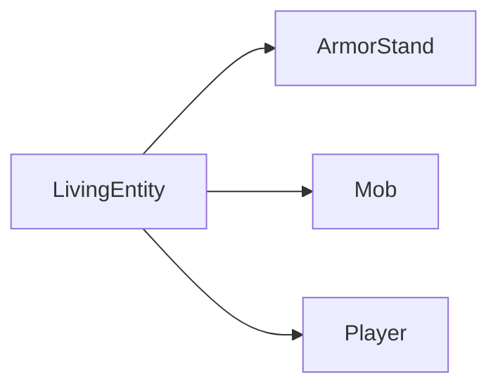
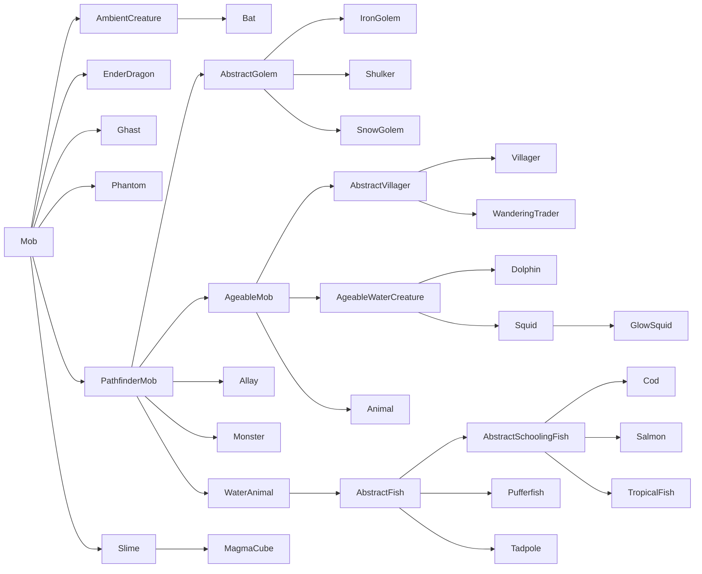
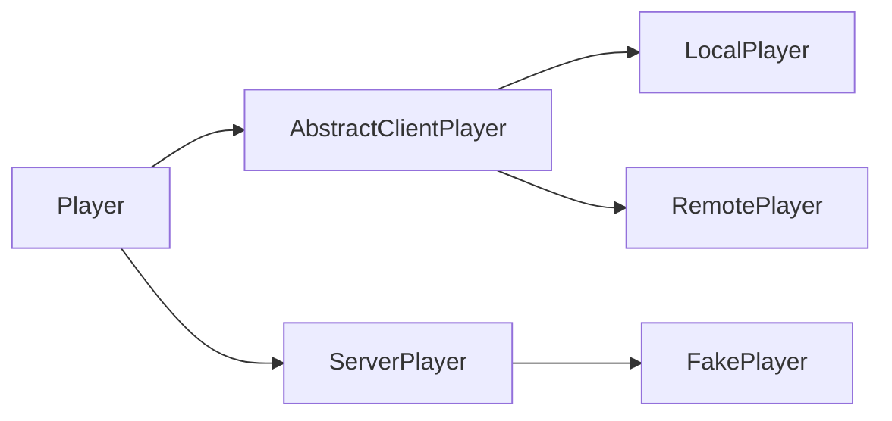

# 生物实体、生物与玩家

生物实体是[实体]的一个大子集，它们都继承自共同的 `LivingEntity` 超类。这包括生物（通过 `Mob` 子类）、玩家（通过 `Player` 子类）和盔甲架（通过 `ArmorStand` 子类）。

生物实体具有许多普通实体所没有的额外属性。这些属性包括[属性]、[生物效果][mobeffects]、伤害追踪等等。

## 生命值、伤害与治疗

_另请参阅：[属性][attributes]。_

将生物实体与其他实体区分开来的最显著特征之一是功能完善的生命值系统。生物实体通常有最大生命值、当前生命值，有时还有护甲或自然恢复等。

默认情况下，最大生命值由 `minecraft:generic.max_health` [属性][attributes]决定，而当前生命值在[生成]时设置为相同的值。当通过调用[`Entity#hurtServer`][hurt]对实体造成伤害时，当前生命值会根据伤害计算而减少。许多实体，例如僵尸，默认情况下会保持在该降低的生命值，而有些实体，例如玩家，可以再次治愈这些失去的生命值。

要获取或设置最大生命值，可以直接读取或写入该属性，如下所示：

```java
// Get the attribute map of our entity.
AttributeMap attributes = entity.getAttributes();

// Get the max health of our entity.
float maxHealth = attributes.getValue(Attributes.MAX_HEALTH);
// Shortcut for the above.
maxHealth = entity.getMaxHealth();

// Setting the max health must either be done by getting the AttributeInstance and calling #setBaseValue, or by
// adding an attribute modifier. We will do the former here. Please refer to the Attributes article for more details.
attributes.getInstance(Attributes.MAX_HEALTH).setBaseValue(50);
```

当[受到伤害][damage]时，生物实体会进行一些额外的计算，例如考虑 `minecraft:generic.armor` 属性（除非[伤害类型][damagetypes]在 `minecraft:bypasses_armor` [标签][tags]中）以及 `minecraft:generic.absorption` 属性。生物实体也可以重写 `#onDamageTaken` 来执行攻击后的行为；只有当最终伤害值大于零时才会调用此方法。

### 伤害事件

由于伤害流程的复杂性，有多个事件可供您挂钩，它们按列出的顺序触发。这通常用于您希望对非您自己（或不一定）的实体进行的伤害修改，即，如果您想修改对 Minecraft 或其他模组的实体造成的伤害，或者如果您想修改对任何实体（可能是也可能不是您自己的）造成的伤害。

所有这些事件的共同点是 `DamageContainer`。一个新的 `DamageContainer` 在攻击开始时实例化，并在攻击结束后丢弃。它包含原始的[`DamageSource`][damagesources]、原始伤害量，以及所有单独修改的列表——护甲、吸收、[附魔]、[生物效果][mobeffects]等。`DamageContainer` 会传递给下面列出的所有事件，您可以检查已经完成了哪些修改，以便根据需要进行自己的更改。

#### `EntityInvulnerabilityCheckEvent`

此事件允许模组为实体绕过或添加无敌状态。此事件也会为非生物实体触发。您可以使用此事件使实体对攻击免疫，或剥夺其可能拥有的现有免疫力。

由于技术原因，对此事件的挂钩应是确定性的，并且仅取决于伤害类型。这意味着随机的无敌几率，或仅在特定伤害量下才适用的无敌状态，应改为在 `LivingIncomingDamageEvent` 中添加（见下文）。

#### `LivingIncomingDamageEvent`

此事件仅在服务器端调用，主要用于两个用例：动态取消攻击，以及添加减伤修饰符回调。

动态取消攻击基本上是添加一个非确定性的无敌状态，例如随机几率取消伤害，或根据一天中的时间或受到的伤害量而定的无敌状态等。一致的无敌状态应通过 `EntityInvulnerabilityCheckEvent` 来实现（见上文）。

减伤修饰符回调允许您修改一部分已执行的伤害减免。例如，它允许您将护甲伤害减免的效果降低 50%。这也会正确传播到生物效果，它们随后会处理不同的伤害量，等等。可以像这样添加一个减伤修饰符回调：

```java
@SubscribeEvent // on the game event bus
public static void decreaseArmor(LivingIncomingDamageEvent event) {
    // We only apply this decrease to players and leave zombies etc. unchanged
    if (event.getEntity() instanceof Player) {
        // Add our reduction modifier callback.
        event.getDamageContainer().addModifier(
            // The reduction to target. See the DamageContainer.Reduction enum for possible values.
            DamageContainer.Reduction.ARMOR,
            // The modification to perform. Gets the damage container and the base reduction as inputs,
            // and outputs the new reduction. Both input and output reductions are floats.
            (container, baseReduction) -> baseReduction * 0.5f
        );
    }
}
```

回调按添加顺序应用。这意味着在具有较高[优先级]的事件处理程序中添加的回调将首先运行。

#### `LivingShieldBlockEvent`

此事件可用于完全自定义盾牌格挡。这包括引入额外的盾牌格挡、阻止盾牌格挡、修改原版盾牌格挡检查、更改对盾牌或攻击物品造成的伤害、更改盾牌的视角弧度、允许抛射物但阻止近战攻击（或反之）、被动格挡攻击（即不使用盾牌）、仅格挡一定百分比的伤害等。

请注意，此事件并非为超出“类盾牌”物品范围的免疫或攻击取消而设计。

#### `ArmorHurtEvent`

这个事件应该非常不言自明。它在计算攻击造成的护甲伤害时触发，可用于修改对哪个护甲部件造成多少耐久度伤害（如果有的话）。

#### `LivingDamageEvent.Pre`

此事件在造成伤害前立即调用。`DamageContainer` 已完全填充，最终伤害量可用，并且由于此时攻击已被视为成功，事件无法再被取消。

此时，所有类型的修改器都可用，允许您精细地修改伤害量。请注意，此时像护甲伤害这样的事情已经完成了。

#### `LivingDamageEvent.Post`

此事件在造成伤害、吸收值减少、战斗追踪器更新、统计数据和游戏事件处理完毕后调用。它是不可取消的，因为攻击已经发生。此事件通常用于攻击后效果。请注意，即使伤害量为零，该事件也会触发，因此如果需要，请相应地检查该值。

如果您在自己的实体上调用此方法，应考虑重写 `ILivingEntityExtension#onDamageTaken()`。与 `LivingDamageEvent.Post` 不同，此方法仅在伤害大于零时调用。

## 生物效果

_见[生物效果与药水][mobeffects]。_

## 装备

_另见[实体上的容器][containers]。_

## 继承体系

生物实体有一个复杂的类继承体系。如前所述，有三个直接子类（红色类是 `abstract`，蓝色类不是）：



其中，`ArmorStand` 没有子类（也是唯一的非抽象类），所以我们将重点关注 `Mob` 和 `Player` 的类继承体系。

### `Mob` 的继承体系

`Mob` 的类继承体系如下所示（红色类是 `abstract`，蓝色类不是）：



图中未列出的所有其他生物实体都是 `Animal` 或 `Monster` 的子类。

你可能已经注意到了，这非常混乱。例如，为什么蜜蜂、鹦鹉等也不是飞行生物？当查看 `Animal` 和 `Monster` 的子类继承体系时，这个问题会变得更糟，这里将不详细讨论（如果你感兴趣，可以使用IDE的显示继承体系功能查看）。最好承认这一点，但不要为此烦恼。

让我们看看最重要的几个类：

- `PathfinderMob`：包含（惊喜！）寻路逻辑。
- `AgeableMob`：包含实体成长和幼年实体的逻辑。有幼年变种的僵尸和其他怪物不继承此类，它们是 `Monster` 的子类。
- `Animal`：大多数动物继承的类。有更进一步的抽象子类，例如 `AbstractHorse` 或 `TamableAnimal`。
- `Monster`：游戏认为是怪物的大多数实体的抽象类。与`Animal`类似，它还有更进一步的抽象子类，例如 `AbstractPiglin`、`AbstractSkeleton`、`Raider` 和 `Zombie`。
- `WaterAnimal`：水生动物的抽象类，例如鱼、鱿鱼和海豚。由于寻路方式显著不同，它们与其他动物分开。

### `Player` 的继承体系

根据玩家所在的端，会使用不同的玩家类。除了 `FakePlayer`，你永远不需要自己构造一个玩家。



- `AbstractClientPlayer`：这个类被用作两个客户端玩家的基类，两者都用于在[逻辑客户端][logicalsides]上表示玩家。
- `LocalPlayer`：这个类用于表示当前正在运行游戏的玩家。
- `RemotePlayer`：这个类用于表示 `LocalPlayer` 在多人游戏中可能遇到的其他玩家。因此，`RemotePlayer` 在单人游戏环境中不存在。
- `ServerPlayer`：这个类用于在[逻辑服务器][logicalsides]上表示玩家。
- `FakePlayer`：这是`ServerPlayer`的一个特殊子类，设计用作玩家的模拟对象，用于需要玩家上下文的非玩家机制。

## 生成

除了[常规的生成方式][spawning]——即 `/summon` 命令和通过 `EntityType#spawn` 或 `Level#addFreshEntity` 的代码方式——`Mob` 还可以通过其他一些方式生成。`ArmorStand` 可以通过常规方式生成，而 `Player` 除了 `FakePlayer` 之外，不应由您自己实例化。

### 刷怪蛋

为生物[注册]一个刷怪蛋是很常见的（但不是必需的）。这是通过 `SpawnEggItem` 类完成的，NeoForge 对其进行了修改以进行一些额外的设置，例如注册颜色处理器并将刷怪蛋添加到内部的 `SpawnEggItem` -> `EntityType` 映射中。

```java
// Assume we have a DeferredRegister.Items called ITEMS
DeferredItem<SpawnEggItem> MY_ENTITY_SPAWN_EGG = ITEMS.registerItem("my_entity_spawn_egg",
    properties -> new SpawnEggItem(
        // The entity type to spawn.
        MY_ENTITY_TYPE.get(),
        // The properties passed into the lambda, with any additional setup.
        properties
    ));
```

与任何其他物品一样，该物品应被添加到一个[创造模式物品栏选项卡][creative]中，并且应添加一个[客户端物品][clientitem]、[模型]和[翻译]。

### 自然生成

_另请参阅[实体/`MobCategory`][mobcategory]、[世界生成/生物群系修改器/添加生成][addspawns]、[世界生成/生物群系修改器/添加生成成本][addspawncosts]；以及 [Minecraft Wiki][mcwiki] 上的[生成循环][spawncycle]。_

对于 `MobCategory#isFriendly()` 为 true 的实体（默认所有非怪物实体），自然生成每 tick 执行一次；对于 `MobCategory#isFriendly()` 为 false 的实体（所有怪物），每 400 tick（= 20 秒）执行一次。如果 `MobCategory#isPersistent()` 返回 true（主要是动物），此过程还会在区块生成时发生。

对于每个区块和生物类别，都会检查是否已达到生成上限。更技术性地说，这是检查在周围 `loadedChunks` 区域内，该 `MobCategory` 的实体数量是否少于 `MobCategory#getMaxInstancesPerChunk() * loadedChunks / 289`，其中 `loadedChunks` 最多是以当前区块为中心的 17x17 区块区域，如果加载的区块较少（由于渲染距离或类似原因），则区块数会更少。

接下来，对于每个区块，要求在至少一个玩家附近（附近指生物与玩家距离 \<= 128），该 `MobCategory` 的实体数量少于 `MobCategory#getMaxInstancesPerChunk()`，该 `MobCategory` 的生成才会发生。

如果满足条件，会从相关生物群系的生成数据中随机选择一个条目，如果能找到合适的位置，则会进行生成。最多会尝试三次寻找随机位置；如果找不到位置，则不会发生生成。

#### 示例

听起来很复杂？让我们通过一个在平原生物群系中生成动物的例子来过一遍。

在平原生物群系中，游戏每刻都会尝试从 `CREATURE` 生物类别中生成实体，该类别包含以下条目：

```json5
[
    {"type": "minecraft:sheep",   "minCount": 4, "maxCount": 4, "weight": 12},
    {"type": "minecraft:pig",     "minCount": 4, "maxCount": 4, "weight": 10},
    {"type": "minecraft:chicken", "minCount": 4, "maxCount": 4, "weight": 10},
    {"type": "minecraft:cow",     "minCount": 4, "maxCount": 4, "weight": 8 },
    {"type": "minecraft:horse",   "minCount": 2, "maxCount": 6, "weight": 5 },
    {"type": "minecraft:donkey",  "minCount": 1, "maxCount": 3, "weight": 1 }
]
```

由于 `CREATURE` 的生成上限是 10，游戏会扫描以每个玩家当前区块为中心的最多 17x17 区块，寻找其他 `CREATURE` 类型的实体。如果发现的实体数量 \<= 10 * chunkCount / 289（这基本上意味着在未加载的区块附近，生成的几率会变高），则会检查每个找到的实体与最近玩家的距离。如果至少有一个实体的距离大于 128，则可以进行生成。

如果所有这些检查都通过了，会根据权重从上面的列表中选择一个生成条目。假设选择了猪。然后游戏会检查区块中的一个随机位置是否适合生成该实体。如果位置合适，则会根据生成数据中指定的最小和最大数量生成实体（在我们的例子中是正好 4 头猪）。如果位置不合适，游戏会用不同的位置再试两次。如果仍然找不到位置，生成将被取消。

[addspawncosts]: ../worldgen/biomemodifier.md#add-spawn-costs
[addspawns]: ../worldgen/biomemodifier.md#add-spawns
[attributes]: attributes.md
[clientitem]: ../resources/client/models/items.md
[containers]: ../blockentities/container.md
[creative]: ../items/index.md#creative-tabs
[damage]: index.md#damaging-entities
[damagesources]: ../resources/server/damagetypes.md#creating-and-using-damage-sources
[damagetypes]: ../resources/server/damagetypes.md
[enchantments]: ../resources/server/enchantments/index.md
[entities]: index.md
[hurt]: index.md#damaging-entities
[logicalsides]: ../concepts/sides.md#the-logical-side
[mcwiki]: https://minecraft.wiki
[mobcategory]: index.md#mobcategory
[mobeffects]: ../items/mobeffects.md
[model]: ../resources/client/models/index.md
[priority]: ../concepts/events.md#priority
[register]: ../concepts/registries.md
[spawncycle]: https://minecraft.wiki/w/Mob_spawning#Spawn_cycle
[spawning]: index.md#spawning-entities
[tags]: ../resources/server/tags.md
[translation]: ../resources/client/i18n.md