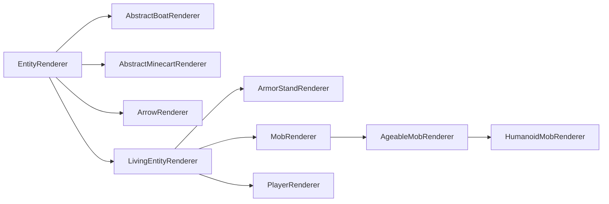

# 实体渲染器

实体渲染器用于定义实体的渲染行为。它们仅存在于[逻辑和物理客户端][sides]上。

实体渲染采用所谓的实体渲染状态。简单来说，这是一个持有渲染器所需的所有值的对象。每次渲染实体时，都会更新渲染状态，然后 `#render` 方法使用该渲染状态来渲染实体。这可能是为了在某个时候将其适配为延迟渲染系统，即预先收集渲染信息（这可能可以多线程处理），然后在稍后的时间点进行渲染。

## 创建一个实体渲染器

最简单的实体渲染器是直接继承 `EntityRenderer` 的渲染器：

```java
// The generic type in the superclass should be set to what entity you want to render.
// If you wanted to enable rendering for any entity, you'd use Entity, like we do here.
// You'd also use an EntityRenderState that fits your use case. More on this below.
public class MyEntityRenderer extends EntityRenderer<Entity, EntityRenderState> {
    // In our constructor, we just forward to super.
    public MyEntityRenderer(EntityRendererProvider.Context context) {
        super(context);
    }

    // Tell the render engine how to create a new entity render state.
    @Override
    public EntityRenderState createRenderState() {
        return new EntityRenderState();
    }

    // Update the render state by copying the needed values from the passed entity to the passed state.
    // Both Entity and EntityRenderState may be replaced with more concrete types,
    // based on the generic types that have been passed to the supertype.
    @Override
    public void extractRenderState(Entity entity, EntityRenderState state, float partialTick) {
        super.extractRenderState(entity, state, partialTick);
        // Extract and store any additional values in the state here.
    }
  
    // Actually render the entity. The first parameter matches the render state's generic type.
    // Calling super will handle leash and name tag rendering for you, if applicable.
    @Override
    public void render(EntityRenderState state, PoseStack poseStack, MultiBufferSource bufferSource, int packedLight) {
        super.render(state, poseStack, bufferSource, packedLight);
        // do your own rendering here
    }
}
```

现在我们有了实体渲染器，我们还需要注册它并将其与所属实体连接。这是在 [`EntityRenderersEvent.RegisterRenderers`][events] 中完成的，如下所示：

```java
@SubscribeEvent // on the mod event bus only on the physical client
public static void registerEntityRenderers(EntityRenderersEvent.RegisterRenderers event) {
    event.registerEntityRenderer(MY_ENTITY_TYPE.get(), MyEntityRenderer::new);
}
```

## 实体渲染状态

如前所述，实体渲染状态用于将渲染所用的值与实体本身的实际值分离开来。它们没有其他更深层的含义，它们真的只是可变的数据存储对象。因此，扩展起来非常简单：

```java
public class MyEntityRenderState extends EntityRenderState {
    public ItemStack stackInHand;
}
```

就这么简单。继承该类，添加你的字段，将 `EntityRenderer` 中的泛型类型更改为你的类，然后你就可以开始了。现在唯一剩下的事情就是在 `EntityRenderer#extractRenderState` 中更新那个 `stackInHand` 字段，如上所述。

### 渲染状态修改

除了能够定义新的实体渲染状态外，NeoForge 还引入了一个允许修改现有渲染状态的系统。

为此，可以创建一个 `ContextKey<T>`（其中 `T` 是您想更改的数据的类型）并将其存储在一个静态字段中。然后，您可以在 `RegisterRenderStateModifiersEvent` 的事件处理程序中使用它，如下所示：

```java
public static final ContextKey<String> EXAMPLE_CONTEXT = new ContextKey<>(
    // The id of your context key. Used for distinguishing between keys internally.
    ResourceLocation.fromNamespaceAndPath("examplemod", "example_context"));

@SubscribeEvent // on the mod event bus only on the physical client
public static void registerRenderStateModifiers(RegisterRenderStateModifiersEvent event) {
    event.registerEntityModifier(
        // A TypeToken for the renderer. It is REQUIRED for this to be instantiated as an anonymous class
        // (i.e., with {} at the end) and to have explicit generic parameters, due to generics nonsense.
        new TypeToken<LivingEntityRenderer<LivingEntity, LivingEntityRenderState, ?>>(){},
        // The modifier itself. This is a BiConsumer of the entity and the entity render state.
        // Exact generic types are inferred from the generics in the renderer class used.
        (entity, state) -> state.setRenderData(EXAMPLE_CONTEXT, "Hello World!");
    );
  
    // Overload of the above method that accepts a Class<?>.
    // This should ONLY be used for renderers without any generics, such as PlayerRenderer.
    event.registerEntityModifier(
        PlayerRenderer.class,
        (entity, state) -> state.setRenderData(EXAMPLE_CONTEXT, "Hello World!");
    );
}
```

:::tip
通过向 `EntityRenderState#setRenderData` 传递 `null` 作为第二个参数，可以清除该值。例如：

```java
state.setRenderData(EXAMPLE_CONTEXT, null);
```
:::

然后可以在需要的地方通过 `EntityRenderState#getRenderData` 检索此数据。还提供了帮助方法 `#getRenderDataOrThrow` 和 `#getRenderDataOrDefault`。

## 继承体系

和实体本身一样，实体渲染器也有一个类继承体系，但没有那么分层。该继承体系中最重要的类之间的关系如下（红色类是`abstract`，蓝色类不是）：



- `EntityRenderer`：抽象基类。许多渲染器，尤其是几乎所有非生物实体的渲染器，都直接继承此类。
- `ArrowRenderer`, `AbstractBoatRenderer`, `AbstractMinecartRenderer`：这些类的存在主要是为了方便，并被用作更具体的渲染器的父类。
- `LivingEntityRenderer`：用于[生物实体][livingentity]渲染器的抽象基类。直接子类包括 `ArmorStandRenderer` 和 `PlayerRenderer`。
- `ArmorStandRenderer`：不言自明。
- `PlayerRenderer`：用于渲染玩家。请注意，与大多数其他渲染器不同，可能同时存在用于不同上下文的该类的多个实例。
- `MobRenderer`：用于 `Mob` 渲染器的抽象基类。许多渲染器直接继承此类。
- `AgeableMobRenderer`：用于具有幼年变种的 `Mob` 渲染器的抽象基类。这包括具有幼年变种的怪物，例如疣猪兽。
- `HumanoidMobRenderer`：人形实体渲染器的抽象基类。例如，僵尸和骷髅使用此类。

与各种实体类一样，请使用最适合您用例的类。请注意，其中许多类在其泛型中具有相应的类型界限；例如，`LivingEntityRenderer` 对 `LivingEntity` 和 `LivingEntityRenderState` 有类型界限。

## 实体模型、图层定义和渲染图层

更复杂的实体渲染器，特别是 `LivingEntityRenderer`，使用一个图层系统，其中每个图层由一个 `RenderLayer` 表示。一个渲染器可以使用多个 `RenderLayer`，并且渲染器可以决定在什么时候渲染哪个（些）图层。例如，鞘翅使用一个独立的图层，其渲染独立于佩戴它的 `LivingEntity`。类似地，玩家斗篷也是一个独立的图层。

`RenderLayer`s 定义了一个 `#render` 方法，它——惊喜！——渲染图层。与大多数其他渲染方法一样，你基本上可以在这里渲染任何你想要的东西。然而，一个非常常见的用例是在这里渲染一个单独的模型，例如用于护甲或类似的装备部件。

为此，我们首先需要一个可以渲染的模型。我们使用 `EntityModel` 类来做到这一点。`EntityModel` 基本上是供渲染器使用的立方体和相关纹理的列表。它们通常在实体渲染器的构造函数首次创建时静态创建。

:::note
由于我们现在操作的是 `LivingEntityRenderer`，以下代码将假设 `MyEntity extends LivingEntity` 且 `MyEntityRenderState extends LivingEntityRenderState`，以匹配泛型类型界限。
:::

### 创建实体模型类和图层定义

让我们从创建一个实体模型类开始：

```java
public class MyEntityModel extends EntityModel<MyEntityRenderState> {}
```

请注意，在上面的示例中，我们直接继承了 `EntityModel`；根据您的用例，使用其子类之一可能更合适。创建新模型时，建议您查看与您用例最接近的现有模型，然后以此为基础进行操作。

接下来，我们创建一个 `LayerDefinition`。`LayerDefinition` 基本上是一个立方体列表，然后我们可以将其烘焙成一个 `EntityModel`。定义一个 `LayerDefinition` 看起来像这样：

```java
public class MyEntityModel extends EntityModel<MyEntityRenderState> {
    // A static method in which we create our layer definition. createBodyLayer() is the name
    // most vanilla models use. If you have multiple layers, you will have multiple of these static methods.
    public static LayerDefinition createBodyLayer() {
        // Create our mesh.
        MeshDefinition mesh = new MeshDefinition();
        // The mesh initially contains no object other than the root, which is invisible (has a size of 0x0x0).
        PartDefinition root = mesh.getRoot();
        // We add a head part.
        PartDefinition head = root.addOrReplaceChild(
            // The name of the part.
            "head",
            // The CubeListBuilder we want to add.
            CubeListBuilder.create()
                // The UV coordinates to use within the texture. Texture binding itself is explained below.
                // In this example, we start at U=10, V=20.
                .texOffs(10, 20)
                // Add our cube. May be called multiple times to add multiple cubes.
                // This is relative to the parent part. For the root part, it is relative to the entity's position.
                // Be aware that the y axis is flipped, i.e. "up" is subtractive and "down" is additive.
                .addBox(
                    // The top-left-back corner of the cube, relative to the parent object's position.
                    -5, -5, -5,
                    // The size of the cube.
                    10, 10, 10
                )
                // Call texOffs and addBox again to add another cube.
                .texOffs(30, 40)
                .addBox(-1, -1, -1, 1, 1, 1)
                // Various overloads of addBox() are available, which allow for additional operations
                // such as texture mirroring, texture scaling, specifying the directions to be rendered,
                // and a global scale to all cubes, known as a CubeDeformation.
                // This example uses the latter, please check the usages of the individual methods for more examples.
                .texOffs(50, 60)
                .addBox(5, 5, 5, 4, 4, 4, CubeDeformation.extend(1.2f)),
            // The initial positioning to apply to all elements of the CubeListBuilder. Besides PartPose#offset,
            // PartPose#offsetAndRotation is also available. This can be reused across multiple PartDefinitions.
            // This may not be used by all models. For example, making custom armor layers will use the associated
            // player (or other humanoid) renderer's PartPose instead to have the armor "snap" to the player model.
            PartPose.offset(0, 8, 0)
        );
        // We can now add children to any PartDefinition, thus creating a hierarchy.
        PartDefinition part1 = root.addOrReplaceChild(...);
        PartDefinition part2 = head.addOrReplaceChild(...);
        PartDefinition part3 = part1.addOrReplaceChild(...);
        // At the end, we create a LayerDefinition from the MeshDefinition.
        // The two integers are the expected dimensions of the texture; 64x32 in our example.
        return LayerDefinition.create(mesh, 64, 32);
    }
}
```

:::tip
[Blockbench][blockbench] 建模程序是创建实体模型的好帮手。为此，请在 Blockbench 中创建模型时选择“Modded Entity”选项。

Blockbench 还有一个选项，可以将模型导出为 `LayerDefinition` 创建方法，可以在 `File -> Export -> Export Java Entity` 中找到。
:::

### 注册图层定义

有了实体图层定义后，我们需要在 `EntityRenderersEvent.RegisterLayerDefinitions` 中注册它。为此，我们需要一个 `ModelLayerLocation`，它实质上充当了我们图层的标识符（记住，一个实体可以有多个图层）。

```java
// Our ModelLayerLocation.
public static final ModelLayerLocation MY_LAYER = new ModelLayerLocation(
    // Should be the name of the entity this layer belongs to.
    // May be more generic if this layer can be used on multiple entities.
    ResourceLocation.fromNamespaceAndPath("examplemod", "example_entity"),
    // The name of the layer itself. Should be main for the entity's base model,
    // and a more descriptive name (e.g. "wings") for more specific layers.
    "main"
);

@SubscribeEvent // on the mod event bus only on the physical client
public static void registerLayerDefinitions(EntityRenderersEvent.RegisterLayerDefinitions event) {
    // Add our layer here.
    event.add(MY_LAYER, MyEntityModel::createBodyLayer);
}
```

### 创建渲染图层并烘焙图层定义

下一步是烘焙图层定义，为此我们将首先回到实体模型类：

```java
public class MyEntityModel extends EntityModel<MyEntityRenderState> {
    // Storing specific model parts as fields for use below.
    private final ModelPart head;
  
    // The ModelPart passed here is the root of our baked model.
    // We will get to the actual baking in just a moment.
    public MyEntityModel(ModelPart root) {
        // The super constructor call can optionally specify a RenderType.
        super(root);
        // Store the head part for use below.
        this.head = root.getChild("head");
    }

    public static LayerDefinition createBodyLayer() {...}

    // Use this method to update the model rotations, visibility etc. from the render state. If you change the
    // generic parameter of the EntityModel superclass, this parameter type changes with it.
    @Override
    public void setupAnim(MyEntityRenderState state) {
        // Calling super to reset all values to default.
        super.setupAnim(state);
        // Change the model parts.
        head.visible = state.myBoolean();
        head.xRot = state.myXRotation();
        head.yRot = state.myYRotation();
        head.zRot = state.myZRotation();
    }
}
```

现在我们的模型能够正确地接收烘焙后的 `ModelPart`，我们可以创建我们的 `RenderLayer` 子类并使用它来烘焙 `LayerDefinition`，如下所示：

```java
// The generic parameters need the proper types you used everywhere else up to this point.
public class MyRenderLayer extends RenderLayer<MyEntityRenderState, MyEntityModel> {
    private final MyEntityModel model;
  
    // Create the render layer. The renderer parameter is required for passing to super.
    // Other parameters can be added as needed. For example, we need the EntityModelSet for model baking.
    public MyRenderLayer(MyEntityRenderer renderer, EntityModelSet entityModelSet) {
        super(renderer);
        // Bake and store our layer definition, using the ModelLayerLocation from back when we registered the layer definition.
        // If applicable, you can also store multiple models this way and use them below.
        this.model = new MyEntityModel(entityModelSet.bakeLayer(MY_LAYER));
    }

    @Override
    public void render(PoseStack poseStack, MultiBufferSource bufferSource, int packedLight, MyEntityRenderState renderState, float yRot, float xRot) {
        // Render the layer here. We have stored the entity model in a field, you probably want to use it in some way.
    }
}
```

### 将渲染图层添加到实体渲染器

最后，为了将所有这些结合起来，我们可以将图层添加到我们的渲染器中（如果您还记得的话，它现在需要是一个生物渲染器），如下所示：

```java
// Plugging in our custom render state class as the generic type.
// Also, we need to implement RenderLayerParent. Some existing renderers, such as LivingEntityRenderer, do this for you.
public class MyEntityRenderer extends LivingEntityRenderer<MyEntity, MyEntityRenderState, MyEntityModel> {
    public MyEntityRenderer(EntityRendererProvider.Context context) {
        // For LivingEntityRenderer, the super constructor requires a "base" model and a shadow radius to be supplied.
        super(context, new MyEntityModel(context.bakeLayer(MY_LAYER)), 0.5f);
        // Add the layer. Get the EntityModelSet from the context. For the purpose of the example,
        // we ignore that the render layer renders the "base" model, this would be a different model in practice.
        this.addLayer(new MyRenderLayer(this, context.getModelSet()));
    }

    @Override
    public MyEntityRenderState createRenderState() {
        return new MyEntityRenderState();
    }

    @Override
    public void extractRenderState(MyEntity entity, MyEntityRenderState state, float partialTick) {
        super.extractRenderState(entity, state, partialTick);
        // Extract your own stuff here, see the beginning of the article.
    }

    @Override
    public void render(MyEntityRenderState state, PoseStack poseStack, MultiBufferSource bufferSource, int packedLight) {
        // Calling super will automatically render the layer for you.
        super.render(state, poseStack, bufferSource, packedLight);
        // Then, do custom rendering here, if applicable.
    }

    // getTextureLocation is an abstract method in LivingEntityRenderer that we need to override.
    // The texture path is relative to textures/entity, so in this example, the texture should be located at
    // assets/examplemod/textures/entity/example_entity.png. The texture will then be supplied to and used by the model.
    @Override
    public ResourceLocation getTextureLocation(MyEntityRenderState state) {
        return ResourceLocation.fromNamespaceAndPath("examplemod", "example_entity");
    }
}
```

### 一次性概览

有点多了？由于这个系统相当复杂，这里再次列出了所有组件，（几乎）没有多余的说明：

```java
public class MyEntity extends LivingEntity {...}
```

```java
public class MyEntityRenderState extends LivingEntityRenderState {...}
```

```java
public class MyEntityModel extends EntityModel<MyEntityRenderState> {
    public static final ModelLayerLocation MY_LAYER = new ModelLayerLocation(
            ResourceLocation.fromNamespaceAndPath("examplemod", "example_entity"),
            "main"
    );
    private final ModelPart head;
  
    public MyEntityModel(ModelPart root) {
        super(root);
        this.head = root.getChild("head");
        // ...
    }

    public static LayerDefinition createBodyLayer() {
        MeshDefinition mesh = new MeshDefinition();
        PartDefinition root = mesh.getRoot();
        PartDefinition head = root.addOrReplaceChild(
            "head",
            CubeListBuilder.create().texOffs(10, 20).addBox(-5, -5, -5, 10, 10, 10),
            PartPose.offset(0, 8, 0)
        );
        // ...
        return LayerDefinition.create(mesh, 64, 32);
    }

    @Override
    public void setupAnim(MyEntityRenderState state) {
        super.setupAnim(state);
        // ...
    }
}
```

```java
public class MyRenderLayer extends RenderLayer<MyEntityRenderState, MyEntityModel> {
    private final MyEntityModel model;
  
    public MyRenderLayer(MyEntityRenderer renderer, EntityModelSet entityModelSet) {
        super(renderer);
        this.model = new MyEntityModel(entityModelSet.bakeLayer(MyEntityModel.MY_LAYER));
    }

    @Override
    public void render(PoseStack poseStack, MultiBufferSource bufferSource, int packedLight, MyEntityRenderState renderState, float yRot, float xRot) {
        // ...
    }
}
```

```java
public class MyEntityRenderer extends LivingEntityRenderer<MyEntity, MyEntityRenderState, MyEntityModel> {
    public MyEntityRenderer(EntityRendererProvider.Context context) {
        super(context, new MyEntityModel(context.bakeLayer(MY_LAYER)), 0.5f);
        this.addLayer(new MyRenderLayer(this, context.getModelSet()));
    }

    @Override
    public MyEntityRenderState createRenderState() {
        return new MyEntityRenderState();
    }

    @Override
    public void extractRenderState(MyEntity entity, MyEntityRenderState state, float partialTick) {
        super.extractRenderState(entity, state, partialTick);
        // ...
    }

    @Override
    public void render(MyEntityRenderState state, PoseStack poseStack, MultiBufferSource bufferSource, int packedLight) {
        super.render(state, poseStack, bufferSource, packedLight);
        // ...
    }

    @Override
    public ResourceLocation getTextureLocation(MyEntityRenderState state) {
        return ResourceLocation.fromNamespaceAndPath("examplemod", "example_entity");
    }
}
```

```java
@SubscribeEvent // on the mod event bus only on the physical client
public static void registerLayerDefinitions(EntityRenderersEvent.RegisterLayerDefinitions event) {
    event.add(MyEntityModel.MY_LAYER, MyEntityModel::createBodyLayer);
}

@SubscribeEvent // on the mod event bus only on the physical client
public static void registerEntityRenderers(EntityRenderersEvent.RegisterRenderers event) {
    event.registerEntityRenderer(MY_ENTITY_TYPE.get(), MyEntityRenderer::new);
}
```

## 修改现有实体渲染器

在某些情况下，需要对现有实体渲染器进行补充，例如，为现有实体渲染额外的效果。大多数情况下，这会影响生物实体，即具有 `LivingEntityRenderer` 的实体。这使我们能够像这样向实体添加[渲染层][renderlayer]：

```java
@SubscribeEvent // on the mod event bus only on the physical client
public static void addLayers(EntityRenderersEvent.AddLayers event) {
    // Add a layer to every single entity type.
    for (EntityType<?> entityType : event.getEntityTypes()) {
        // Get our renderer.
        EntityRenderer<?, ?> renderer = event.getRenderer(entityType);
        // We check if our render layer is supported by the renderer.
        // If you want a more general-purpose render layer, you will need to work with wildcard generics.
        if (renderer instanceof MyEntityRenderer myEntityRenderer) {
            // Add the layer to the renderer. Like above, construct a new MyRenderLayer.
            // The EntityModelSet can be retrieved from the event through #getEntityModels.
            myEntityRenderer.addLayer(new MyRenderLayer(renderer, event.getEntityModels()));
        }
    }
}
```

对于玩家，需要进行一些特殊处理，因为实际上可以有多个玩家渲染器。这些由事件单独管理。我们可以像这样与它们交互：

```java
@SubscribeEvent // on the mod event bus only on the physical client
public static void addPlayerLayers(EntityRenderersEvent.AddLayers event) {
    // Iterate over all possible player models.
    for (PlayerSkin.Model skin : event.getSkins()) {
        // Get the associated PlayerRenderer.
        if (event.getSkin(skin) instanceof PlayerRenderer playerRenderer) {
            // Add the layer to the renderer. This assumes that the render layer
            // has proper generics to support players and player renderers.
            playerRenderer.addLayer(new MyRenderLayer(playerRenderer, event.getEntityModels()));
        }
    }
}
```

## 动画

Minecraft 通过 `AnimationDefinition` 类为实体模型提供了一个动画系统。NeoForge 添加了一个系统，允许这些实体动画在 JSON 文件中定义，类似于第三方库如 [GeckoLib][geckolib]。

动画在位于 `assets/<namespace>/neoforge/animations/entity/<path>.json` 的 JSON 文件中定义（因此对于[资源位置][rl]`examplemod:example`，文件将位于 `assets/examplemod/neoforge/animations/entity/example.json`）。动画文件的格式如下：

```json5
{
    // The duration of the animation, in seconds.
    "length": 1.5,
    // Whether the animation should loop (true) or stop (false) when finished.
    // Optional, defaults to false.
    "loop": true,
    // A list of parts to be animated, and their animation data.
    "animations": [
        {
            // The name of the part to be animated. Must match the name of a part
            // defined in your LayerDefinition (see above). If there are multiple matches,
            // the first match from the performed depth-first search will be picked.
            "bone": "head",
            // The value to be changed. See below for available targets.
            "target": "minecraft:rotation",
            // A list of keyframes for the part.
            "keyframes": [
                {
                    // The timestamp of the keyframe, in seconds.
                    // Should be between 0 and the animation length.
                    "timestamp": 0.5,
                    // The actual "value" of the keyframe.
                    "target": [22.5, 0, 0],
                    // The interpolation method to use. See below for available methods.
                    "interpolation": "minecraft:linear"
                }
            ]
        }
    ]
}
```

:::tip
强烈建议将此系统与 [Blockbench][blockbench] 建模软件结合使用，该软件提供了一个[动画转 JSON 插件][bbplugin]。
:::

在你的模型中，你可以像这样使用动画：

```java
public class MyEntityModel extends EntityModel<MyEntityRenderState> {
    // Create and store a reference to the animation holder.
    public static final AnimationHolder EXAMPLE_ANIMATION =
            Model.getAnimation(ResourceLocation.fromNamespaceAndPath("examplemod", "example"));

    // A field to hold the baked animation
    private final KeyframeAnimation example;

    public MyEntityModel(ModelPart root) {
        // Bake the animation for the model
        // Pass in whatever 'ModelPart' that the animation is applied to
        // It should cover all referenced bones
        this.example = EXAMPLE_ANIMATION.get().bake(root);
    }
  
    // Other stuff here.
  
    @Override
    public void setupAnim(MyEntityRenderState state) {
        super.setupAnim(state);
        // Other stuff here.
      
        this.example.apply(
            // Get the animation state to use from your EntityRenderState.
            state.myAnimationState,
            // Your entity age, in ticks.
            state.ageInTicks
        );
        // A specialized version of apply(), designed for walking animations.
        this.example.applyWalk(state.walkAnimationPos, state.walkAnimationSpeed, 1, 1);
        // A version of apply() that only applies the first frame of animation.
        this.example.applyStatic();
    }
}
```

### 关键帧目标

NeoForge 开箱即用地添加了以下关键帧目标：

- `minecraft:position`：目标值被设置为部件的位置值。
- `minecraft:rotation`：目标值被设置为部件的旋转值。
- `minecraft:scale`：目标值被设置为部件的缩放值。

可以通过创建一个新的 `AnimationTarget` 并在 `RegisterJsonAnimationTypesEvent` 中注册它来添加自定义值，如下所示：

```java
@SubscribeEvent // on the mod event bus only on the physical client
public static void registerJsonAnimationTypes(RegisterJsonAnimationTypesEvent event) {
    event.registerTarget(
        // The name of the new target, to be used in JSON and other places.
        ResourceLocation.fromNamespaceAndPath("examplemod", "example"),
        // The AnimationTarget to register.
        new AnimationTarget(...)
    );
}
```

### 关键帧插值

NeoForge 内置了以下关键帧插值方法：

- `minecraft:linear`：线性插值。
- `minecraft:catmullrom`：沿 [Catmull-Rom 样条][catmullrom]进行插值。

可以通过创建一个新的 `AnimationChannel.Interpolation`（这是一个函数式接口）并在 `RegisterJsonAnimationTypesEvent` 中注册它来添加自定义插值，如下所示：

```java
@SubscribeEvent // on the mod event bus only on the physical client
public static void registerJsonAnimationTypes(RegisterJsonAnimationTypesEvent event) {
    event.registerInterpolation(
        // The name of the new interpolation, to be used in JSON and other places.
        ResourceLocation.fromNamespaceAndPath("examplemod", "example"),
        // The AnimationChannel.Interpolation to register.
        (vector, keyframeDelta, keyframes, currentKeyframe, nextKeyframe, scale) -> {...}
    );
}
```

[bbplugin]: https://www.blockbench.net/plugins/animation_to_json
[blockbench]: https://www.blockbench.net/
[catmullrom]: https://en.wikipedia.org/wiki/Cubic_Hermite_spline#Catmull–Rom_spline
[events]: ../concepts/events.md
[geckolib]: https://github.com/bernie-g/geckolib
[livingentity]: livingentity.md
[renderlayer]: #creating-a-render-layer-and-baking-a-layer-definition
[rl]: ../misc/resourcelocation.md
[sides]: ../concepts/sides.md